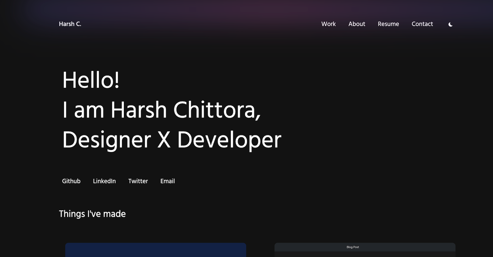

Live: https://harshchittora.netlify.app/

Features -
* Modern Stack (Next.js + TailwindCSS)
* Minimal Design
* Easy To Browse
* Easy To Customize your details With GUI
* Dark Mode

Sections
* Header
* Work
* Services
* About
* Contact

How To Use
* Clone this repo
* run yarn
* yarn dev

How To Deploy -
* There are many ways to Deploy this repo.
* here we are gonna use Netlify
* Login into Netlify with GitHub
* After login select the forked repo or the repo you want to deploy
* After selecting Netlify will automatically deploy your website.

The quickest way to deploy this repo - 

Netlify: https://www.netlify.com/

How To Contribute -
I would be very happy to review your PRs and all the awesome things that you can improve on this portfolio.
Tech Stack Used -
* Next.js
* TailwindCSS

Open for Opportunity: Reach out, and let's make things happen. Looking forward to hearing from you soon!

Thank you for watching! If you liked this portfolio template, don't forget to give it a ⭐

